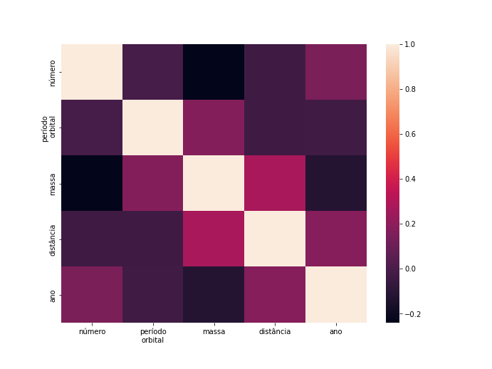
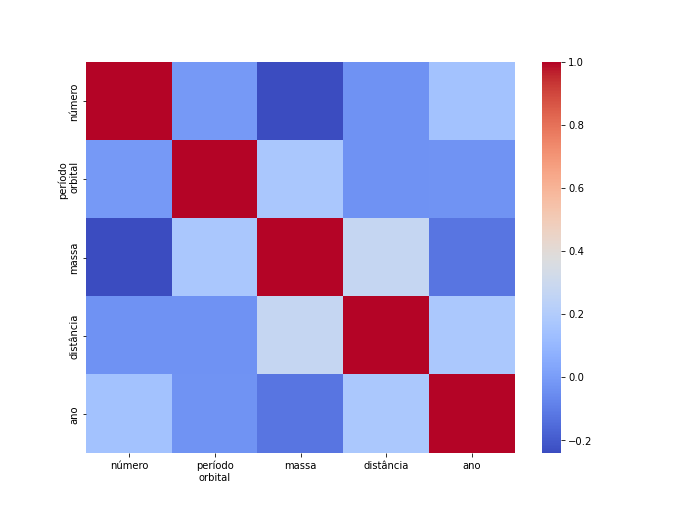
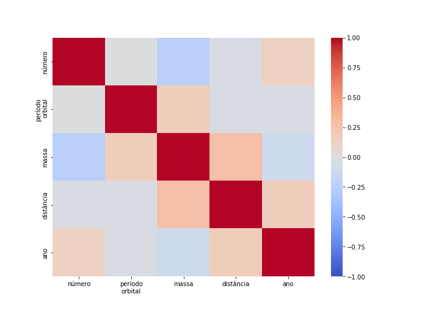
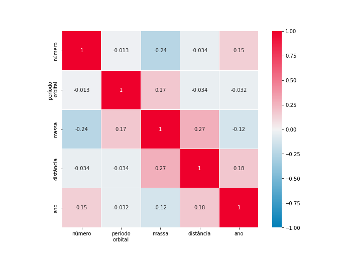

# Criando um *heatmap*

<figure>

<figcaption align="center">
Foto por <a href="https://unsplash.com/@ben_mcleod">Ben McLeod</a> em <a href="https://unsplash.com/photos/y1IW39AuIbc">Unsplash</a>.
</figcaption>
</figure>

Durante uma análise exploratória de dados, uma técnica muito usada para se ter uma noção inicial de como os dados se relacionam é o *heatmap* da matriz de correlação.
Quando bem construído, ele dá com bastante facilidade uma visão geral de quais variáveis estão correlacionadas com quais e se essas correlações são positivas ou negativas.
É praticamente uma "vista panorâmica" dos dados.

<figure>

<figcaption align="center">
O heatmap é como uma vista panorâmica dos dados.
Foto por <a href="https://unsplash.com/@jaimespaniol">Jaime Spaniol</a> em <a href="https://unsplash.com/photos/9Vypg4Imz-Q">Unsplash</a>.
</figcaption>
</figure>

Dito isso, existem alguns detalhes importantes para se tirar o melhor proveito do resultado.
A escolha da escala de cores em particular pode fazer toda a diferença na facilidade de se perceber a informação.
Nesse texto, eu vou tentar explicar porque eu acredito que as cores de um *heatmap* são tão importantes e mostrar um forma de obter o melhor resultado possível, mas que infelizmente parece ser menos usada do que deveria.

Vale salientar que eu estou partindo do pressuposto que você já entende o que é uma matriz de correlação.
Assim nós podemos nos concentrar somente no *heatmap* e em como fazer ele ficar ótimo.
Além disso, eu vou exemplificar o que estou falando usando a biblioteca de visualização ```seaborn```, do ```Python```.
O *dataset* que vamos utilizar traz dados sobre planetas observados fora do sistema solar e pode ser obtido a partir do próprio ```seaborn```.

Vamos começar preparando o terreno, importando as bibliotecas e carregando os dados.
Como o *dataset* é carregado como um ```pandas.DataFrame```, podemos usar o método ```corr``` para obter a matriz de correlação.

```
import matplotlib.pyplot as plt
import numpy as np
import seaborn as sns

planets = sns.load_dataset('planets')
corr_matrix = planets.corr()
```

## Antes de mais nada, o que é exatamente um *heatmap*?

Um *heatmap*, ou mapa de calor, é uma forma de visualização de dados que associa cores à intensidade da variável mostrada.
Como estamos falando de uma matriz de correlação, a visualização acaba tendo a cara de uma matriz mesmo, toda quadriculada, em que a cor de cada elemento indica a magnitude da correlação entre duas variáveis.

Para ilustrar essas ideias, vamos começar criando uma visualização bem básica usando a função ```sns.heatmap```.
```
labels = ['número', 'período\norbital', 'massa', 'distância', 'ano']

sns.heatmap(
    corr_matrix,
    xticklabels=labels,
    yticklabels=labels,
)
```

<figure>

<figcaption align="center">
Este heatmap foi construído com os parâmetros padrões do seaborn.
Daqui a pouco vamos ver que dá pra melhorar muito.
</figcaption>
</figure>

A escolha de cores de um *heatmap* é livre, mas deve ser feita de tal forma que os tipos e intensidades das correlações sejam **claramente distinguíveis**.
E é justamente sobre esse conceito de claramente distinguíveis que eu quero tratar.

Para entender melhor do que eu estou falando, vamos lembrar de uma característica que toda matriz de correlação tem e que é muito importante de se ter em mente na hora da construção do *heatmap*: os seus valores são limitados no intervalo de -1 até +1, sendo que os valores positivos estão associados a correlações positivas (ou seja, quando uma variável aumenta, a outra também aumenta), enquanto que os valores negativos estão associados a correlações negativas (quando uma variável aumenta, a outra diminui).
Isso quer dizer que valores próximos do 0 indicam correlações fracas e valores próximos de +/-1 indicam correlações fortes (positivas para o sinal de + e negativas para o sinal de -).

## Tá, mas e daí?
Qual é a relevância disso tudo na hora de construir o *heatmap*?
A questão é que a escala de cores escolhida deve conseguir distinguir claramente entre os valores próximos de 0 e os valores próximos de +/-1.
Mais ainda, como é desejável conseguir diferenciar os valores positivos dos negativos, a paleta deve envolver três cores distintas (para -1, 0 e +1), com um gradiente entre elas.

Veja no exemplo do *heatmap* acima como o ```seaborn``` utiliza por padrão uma **escala de cores sequencial**. Essa escala não oferece a distinção clara entre as cores que acabamos de discutir.
Tente identificar quais valores são positivos e quais são negativos.
Bem difícil, não?

O tipo de paleta que nós queremos usar aqui é o que chamamos de uma **escala de cores divergente**, que possui as três regiões bem destacadas. Compare os dois tipos de escalas e perceba a diferença você mesmo.

<figure>

<figcaption align="center">
Veja como as paletas de cores divergentes (esquerda) possuem três regiões claramente distintas: o centro, que queremos associar ao 0, e os dois extremos, que queremos associar a +/-1.
Já as paletas sequenciais (direita) não tem um centro bem definido.
</figcaption>
</figure>

## Melhorando nosso *heatmap*

No ```seaborn```, podemos criar um *heatmap* com uma escala divergente utilizando o parâmetro ```cmap```. Você pode usar qualquer uma das escalas divergentes oferecidas pelo ```matplotlib``` (veja as opções [aqui](https://matplotlib.org/stable/tutorials/colors/colormaps.html#diverging)). Vamos experimentar a *coolwarm*.

```
sns.heatmap(
    corr_matrix,
    cmap='coolwarm',
    xticklabels=labels,
    yticklabels=labels, 
)
```

<figure>

<figcaption align="center">
Veja como uma escala de cores divergente ajuda a distinguir melhor os valores.
</figcaption>
</figure>

Este último heatmap já está melhor do que o anterior, mas note uma coisa: o fato de estarmos usando uma escala divergente não garante que ela vai estar centrada no 0.
Afinal de contas, o computador não consegue adivinhar o que você quer.
Se você olhar com atenção, vai perceber que existem tanto valores positivos quanto negativos com a coloração azul, o que ainda não é ideal.

Por isso é importante prestar atenção para dizer explicitamente essa informação.
No caso do ```seaborn``` isso é feito simplesmente passando os parâmetros ```center```, que define o centro da escala de cores, e ```vmin``` e ```vmax```, que definem os extremos.
Com isso, podemos estabelecer que os valores -1, 0 e 1 vão estar associados às posições de destaque na escala.

```
sns.heatmap(
    corr_matrix,
    cmap='coolwarm',
    center=0,
    vmin=-1,
    vmax=1,
    xticklabels=labels,
    yticklabels=labels,
)
```

<figure>

<figcaption align="center">
Com a escala devidamente centralizada, é imediato identificar quais valores são positivos (os vermelhos), quais são negativos (os azuis) e quais estão muito próximos de 0 (os acinzentados).
</figcaption>
</figure>

Com esse pequeno detalhe, nós conseguimos ver imediatamente quais valores são maiores, menores ou muito próximos de zero. Para matrizes de correlação maiores e mais complexas, esse detalhe pode fazer toda a diferença para que a gente consiga facilmente identificar variáveis que possuem correlações interessantes.

## Melhorando um pouco mais

Apesar de o último *heatmap* que nós fizemos já usar uma escala de cores adequada e ser então fácil de interpretar, ainda é possível tornar ele esteticamente melhor. Os parâmetros ```square``` e ```linewidth``` melhoram a aparência, deixando cada célula quadrada e gerando uma fina linha entre elas. O parâmetro ```annot``` faz com que os valores das correlações sejam escritos diretamente no mapa, permitindo uma interpretação mais precisa.

Também é interessante definir nossa própria escala com a função ```sns.diverging_palette```.
Nela, os parâmetros ```h_neg``` e ```h_pos``` definem as cores dos extremos, e ```s``` é a saturação.
Também precisamos passar o parâmetro ```as_cmap``` para usar no *heatmap*.

```
cmap = sns.diverging_palette(
    h_neg=240,
    h_pos=10,
    s=100,
    as_cmap=True,
)

sns.heatmap(
    corr_matrix,
    cmap=cmap,
    center=0,
    vmin=-1,
    vmax=1,
    square=True,
    linewidths=0.01,
    annot=True,
    xticklabels=labels,
    yticklabels=labels,
)
```

<figure>

<figcaption align="center">
Com alguns detalhes a mais, o heatmap fica com uma aparência ótima e muito fácil de interpretar. Perceba como é imediato identificar os valores positivos e os negativos.
</figcaption>
</figure>

## Conclusão

O principal ponto que eu queria que qualquer leitor pudesse levar deste artigo é a importância de se usar uma **escala de cores divergente** e que esteja devidamente **centralizada** quando fazemos um *heatmap* de uma matriz de correlação.
Não fazer isso pode acabar resultando em uma visualização confusa, em que é muito difícil de entender quais valores são positivos, quais são negativos e onde está o 0!

Espero que esse texto possa ajudar alguém. Obrigado pela leitura! Pra quem quiser conferir o código exato que eu usei pra gerar as visualizações, é só ir lá no meu Github.